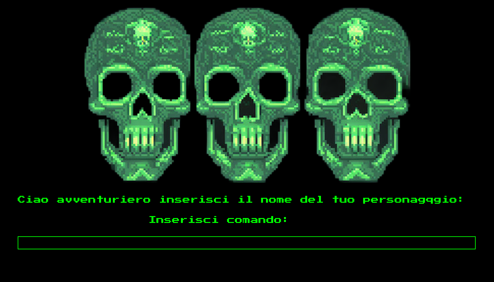

# Death Jungle – Gioco di Avventura Testuale

Benvenuto in **Death Jungle**, un gioco di avventura testuale 2D in cui vestirai i panni di un avventuriero disperso nella giungla alla ricerca del Tesoro Perduto. Esplora ambienti misteriosi, interagisci con oggetti e risolvi enigmi per raggiungere il tuo obiettivo.

## Struttura del Progetto

- `src/` : Contiene il codice sorgente del gioco.
- `test/` : Include i test unitari.
- `Documenti/` : Documentazione dettagliata, inclusi manuali e specifiche tecniche.
- `pom.xml` : File di configurazione per Maven.

## Requisiti

- **Java**: Versione **11** o superiore.
- **Maven**: Versione **3.6** o superiore.

Verifica le versioni installate con:

```bash
java -version
mvn -v
```
## Intallazione
1. Clona il repository
```bash
git clone https://github.com/antozerba/Text-Based-AdventureGame.git
cd Text-Based-AdventureGame
```
2. Compila il progetto
```bash
mvn clean install
```
3. Esegui i test (facoltativi)
```bash
mvn test
```

## Avvio del gioco
Il gioco è runnabile attraverso il comando maven
```bash
mvn exec:java 
```
in alternativo è possibile eseguire il il JAR situato nella cartella /target
```bash
java -jar target/DeathJungle-1.0-SNAPSHOT.jar
```



